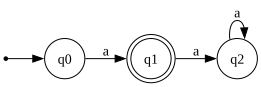

# Exercise 1.1: Recognize the string "a"

## 1. Language Description
This automata recognizes the language `L = {a}`, which consists solely of the string "a". Any other string is rejected.

---
## 2. Sample Strings
* **Accepted Strings:**
    1.  `a`

* **Rejected Strings:**
    1.  `ε` (empty string)
    2.  `aa`
    3.  `b`
    4.  `ab`
    5.  `ba`
    6.  `aaa`
    7.  `aba`
    8.  `bab`
    9.  `bbb`
    10. `a a`

---
## 3. Automata Diagram

---
## 4. Automata Type and Justification
* **Type**: **DFA (Deterministic Finite Automata)**.
* **Justification**: It is a DFA because for every state (`q0`, `q1`, `q2`), there is exactly one defined transition for each symbol in the alphabet (`a`). The automata's path is uniquely determined, and it does not use ε-transitions.

---
## 5. Formal Definition (5-Tuple)
The 5-tuple `M = (Q, Σ, δ, q₀, F)` that defines this automata is:
* **Q** = `{q0, q1, q2}`
* **Σ** = `{a}`
* **q₀** = `q0`
* **F** = `{q1}`
* **δ** (Transition Function):
    * `δ(q0, a) = q1`
    * `δ(q1, a) = q2`
    * `δ(q2, a) = q2`

---
## 6. Source Files
You can view the source code for the diagram or download the JFLAP file using the links below.

* **Graphviz Source:** [View `automata.dot`](./automata.dot)
* **JFLAP File:** [Download `automata.jff`](./automata.jff)