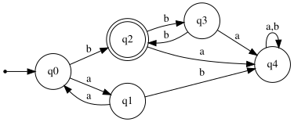

# Exercise 1.2: Even 'a's and Odd 'b's

## 1. Language Description
This automata recognizes the language of strings that start with an even number of 'a's (including zero) and are followed by an odd number of 'b's. The 'a's and 'b's cannot be mixed. The corresponding regular expression is `(aa)*b(bb)*`.

---
## 2. Sample Strings
* **Accepted Strings:**
    1.  `b`
    2.  `bbb`
    3.  `bbbbb`
    4.  `aab`
    5.  `aabbb`
    6.  `aaaab`
    7.  `aabbbbb`
    8.  `aaaaaab`
    9.  `aaaaaabbb`
    10. `aab`

* **Rejected Strings:**
    1.  `ε` (empty string)
    2.  `a`
    3.  `aa`
    4.  `ab`
    5.  `bb`
    6.  `aba` (mixed)
    7.  `bab` (mixed)
    8.  `aaabb` (odd number of 'a's)
    9.  `aabba` (ends with 'a')
    10. `bba` (starts with 'b' but has even count)

---
## 3. Automata Diagram

---
## 4. Automata Type and Justification
* **Type**: **DFA (Deterministic Finite Automata)**.
* **Justification**: It is a DFA because for every state, there is exactly one defined transition for each symbol in the alphabet (`a` and `b`). The automata's path is uniquely determined, and it does not use ε-transitions.

---
## 5. Formal Definition (5-Tuple)
The 5-tuple `M = (Q, Σ, δ, q₀, F)` that defines this automata is:
* **Q** = `{q0, q1, q2, q3, q4}`
* **Σ** = `{a, b}`
* **q₀** = `q0`
* **F** = `{q2}`
* **δ** (Transition Function):

| State | Input 'a' | Input 'b' | Description |
| :---: | :---: | :---: | :--- |
| **q0** | q1 | q2 | Even 'a's count (Initial) |
| **q1** | q0 | q4 | Odd 'a's count |
| **q2** | q4 | q3 | Odd 'b's count (Accepting) |
| **q3** | q4 | q2 | Even 'b's count |
| **q4** | q4 | q4 | Trap State |

---
## 6. Source Files
* **Graphviz Source:** [View `automata.dot`](./automata.dot)
* **JFLAP File:** [Download `automata.jff`](./automata.jff)