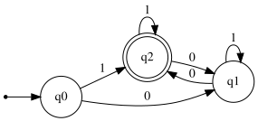
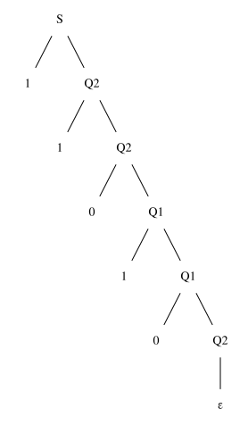

# Exercise 2.2: Non-Empty Strings with an Even Number of Zeros

## 1. Language Description
This automata recognizes the language `L = {X ∈ {0,1}* | X has an even number of 0s and X ≠ ε}`. The language consists of all non-empty binary strings that contain an even number of the symbol '0'.

---
## 2. Sample Strings
* **Accepted Strings:**
    1.  `1`
    2.  `00`
    3.  `11`
    4.  `100`
    5.  `010`
    6.  `001`
    7.  `1111`
    8.  `1010`
    9.  `0000`
    10. `11010`

* **Rejected Strings:**
    1.  `ε` (empty string)
    2.  `0`
    3.  `10`
    4.  `01`
    5.  `000`
    6.  `110`
    7.  `101`
    8.  `011`
    9.  `00000`
    10. `10101`

---
## 3. Automata Diagram

---
## 4. Automata Type and Justification
* **Type**: **DFA (Deterministic Finite Automata)**.
* **Justification**: It is a DFA because for every state, there is exactly one defined transition for each symbol in the alphabet (`0` and `1`). The automata's path is uniquely determined for any input string, and it does not use ε-transitions.

---
## 5. Formal Definition (5-Tuple)
The 5-tuple `M = (Q, Σ, δ, q₀, F)` that defines this automata is:
* **Q** = `{q0, q1, q2}`
* **Σ** = `{0, 1}`
* **q₀** = `q0`
* **F** = `{q2}`
* **δ** (Transition Function):

| State | Input '0' | Input '1' | Description |
| :---: | :---: | :---: | :--- |
| **q0** | q1 | q2 | Initial state (empty string) |
| **q1** | q2 | q1 | Odd number of zeros |
| **q2** | q1 | q2 | Even number of zeros & non-empty (Accepting) |

---
## 6. Source Files
* **Graphviz Source:** [View `automata.dot`](./automata.dot)
* **JFLAP File:** [Download `automata.jff`](./automata.jff)

---
## 7. Regular Grammar (Type 3)
This automaton can be converted into an equivalent Type 3 Regular Grammar `G = (V, T, P, S)`:
* **V (Variables):** `{S, Q1, Q2}`
* **T (Terminals):** `{0, 1}`
* **S (Start Symbol):** `S` (which represents `q0`)
* **P (Production Rules):**
    * `S → 0 Q1`
    * `S → 1 Q2`
    * `Q1 → 0 Q2`
    * `Q1 → 1 Q1`
    * `Q2 → 0 Q1`
    * `Q2 → 1 Q2`
    * `Q2 → ε`      (because `q2` is an accepting state)

---
## 8. Derivation Example
This shows how the grammar generates the accepted string "**11010**".

### Derivation Path
1.  `S → 1 Q2`
2.  `Q2 → 1 Q2`
3.  `Q2 → 0 Q1`
4.  `Q1 → 1 Q1`
5.  `Q1 → 0 Q2`
6.  `Q2 → ε`

### Parse Tree

* **Graphviz Source (Parse Tree):** [View `parse_tree.dot`](./parse_tree.dot)