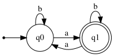

# Exercise 3.1: Strings with an Odd Number of 'a's

## 1. Language Description
This automata recognizes the language `L = {w ∈ {a,b}* | w has an odd number of 'a's}`. The language consists of all strings over the alphabet `{a, b}` that contain an odd number of the symbol 'a'. The number of 'b's is irrelevant.

---
## 2. Sample Strings
* **Accepted Strings:**
    1.  `a`
    2.  `ba`
    3.  `ab`
    4.  `aaa`
    5.  `bab`
    6.  `bbaab`
    7.  `aba`
    8.  `aaaba`
    9.  `bbabb`
    10. `babab`

* **Rejected Strings:**
    1.  `ε` (empty string)
    2.  `b`
    3.  `aaa`
    4.  `bb`
    5.  `bbbb`
    6.  `abaab`
    7.  `babaa`
    8.  `aaab`
    9.  `baaa`
    10. `aaaaa`

---
## 3. Automata Diagram

---
## 4. Automata Type and Justification
* **Type**: **DFA (Deterministic Finite Automata)**.
* **Justification**: It is a DFA because for every state, there is exactly one defined transition for each symbol in the alphabet (`a` and `b`). The automata's path is uniquely determined, and it does not use ε-transitions.

---
## 5. Formal Definition (5-Tuple)
The 5-tuple `M = (Q, Σ, δ, q₀, F)` that defines this automata is:
* **Q** = `{q0, q1}`
* **Σ** = `{a, b}`
* **q₀** = `q0`
* **F** = `{q1}`
* **δ** (Transition Function):

| State | Input 'a' | Input 'b' | Description |
| :---: | :---: | :---: | :--- |
| **q0** | q1 | q0 | Even 'a's count (Initial) |
| **q1** | q0 | q1 | Odd 'a's count (Accepting) |

---
## 6. Source Files
* **Graphviz Source:** [View `automata.dot`](./automata.dot)
* **JFLAP File:** [Download `automata.jff`](./automata.jff)