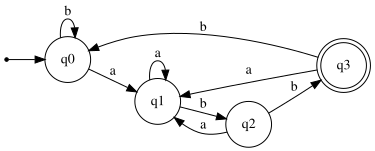
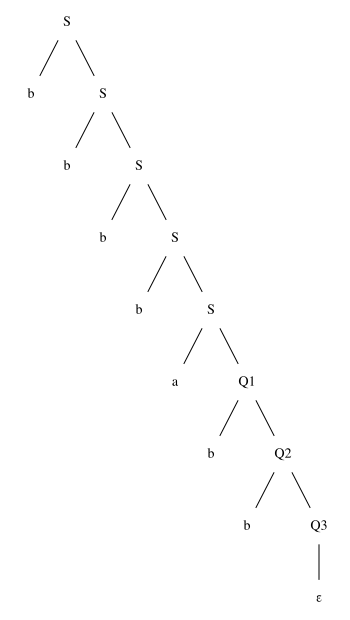

# Exercise 3.2: Strings Ending with "abb"

## 1. Language Description
This automata recognizes the language defined by the regular expression `(a|b)*abb`. This includes all strings over the alphabet `Σ = {a, b}` that end with the substring "abb".

---
## 2. Sample Strings
* **Accepted Strings:**
    1.  `abb`
    2.  `aabb`
    3.  `babb`
    4.  `aaabb`
    5.  `ababb`
    6.  `baabb`
    7.  `bbabb`
    8.  `abababb`
    9.  `aaaaabb`
    10. `bbbbabb`

* **Rejected Strings:**
    1.  `ε` (empty string)
    2.  `a`
    3.  `b`
    4.  `ab`
    5.  `abba`
    6.  `abab`
    7.  `bba`
    8.  `aab`
    9.  `aa`
    10. `bb`

---
## 3. Automata Diagram

---
## 4. Automata Type and Justification
* **Type**: **DFA (Deterministic Finite Automata)**.
* **Justification**: It is a DFA because for every state, there is exactly one defined transition for each symbol in the alphabet (`a` and `b`). The automata's path is uniquely determined for any input string, and it does not use ε-transitions.

---
## 5. Formal Definition (5-Tuple)
The 5-tuple `M = (Q, Σ, δ, q₀, F)` that defines this automata is:
* **Q** = `{q0, q1, q2, q3}`
* **Σ** = `{a, b}`
* **q₀** = `q0`
* **F** = `{q3}`
* **δ** (Transition Function):

| State | Input 'a' | Input 'b' | Description |
| :---: | :---: | :---: | :--- |
| **q0** | q1 | q0 | No part of "abb" suffix matched |
| **q1** | q1 | q2 | Suffix might be "a..." |
| **q2** | q1 | q3 | Suffix might be "ab..." |
| **q3** | q1 | q0 | Suffix is "abb" (Accepting) |

---
## 6. Source Files
* **Graphviz Source:** [View `automata.dot`](./automata.dot)
* **JFLAP File:** [Download `automata.jff`](./automata.jff)

---
## 7. Regular Grammar (Type 3)
This automaton can be converted into an equivalent Type 3 Regular Grammar `G = (V, T, P, S)`:
* **V (Variables):** `{S, Q1, Q2, Q3}`
* **T (Terminals):** `{a, b}`
* **S (Start Symbol):** `S` (which represents `q0`)
* **P (Production Rules):**
    * `S → a Q1`
    * `S → b S`
    * `Q1 → a Q1`
    * `Q1 → b Q2`
    * `Q2 → a Q1`
    * `Q2 → b Q3`
    * `Q3 → a Q1`
    * `Q3 → b S`
    * `Q3 → ε`      (because `q3` is an accepting state)

---
## 8. Derivation Example
This shows how the grammar generates the accepted string "**bbbbabb**".

### Derivation Path
1.  `S → b S`
2.  `S → b S`
3.  `S → b S`
4.  `S → b S`
5.  `S → a Q1`
6.  `Q1 → b Q2`
7.  `Q2 → b Q3`
8.  `Q3 → ε`

### Parse Tree

* **Graphviz Source (Parse Tree):** [View `parse_tree.dot`](./parse_tree.dot)