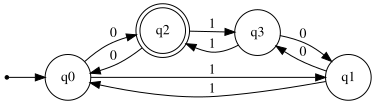
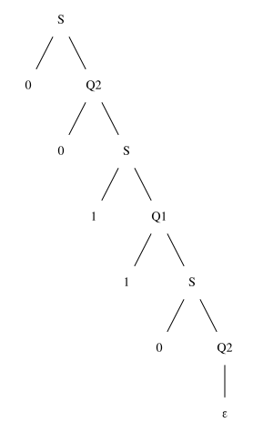

# Exercise 4.1: Odd '0's and Even '1's

## 1. Language Description
This automata recognizes the language `L = {w ∈ {0,1}* | w has an odd number of '0's AND an even number of '1's}`. The count of '0's must be odd, and the count of '1's must be even (zero is considered an even number).

---
## 2. Sample Strings
* **Accepted Strings:**
    1.  `0`
    2.  `110`
    3.  `101`
    4.  `011`
    5.  `000`
    6.  `01010`
    7.  `11110`
    8.  `00110`
    9.  `1011101`
    10. `00000`

* **Rejected Strings:**
    1.  `ε` (even 0s, even 1s)
    2.  `1` (even 0s, odd 1s)
    3.  `00` (even 0s, even 1s)
    4.  `01` (odd 0s, odd 1s)
    5.  `10` (odd 0s, odd 1s)
    6.  `11` (even 0s, even 1s)
    7.  `111` (even 0s, odd 1s)
    8.  `001` (even 0s, odd 1s)
    9.  `100` (even 0s, even 1s)
    10. `1010` (even 0s, even 1s)

---
## 3. Automata Diagram

---
## 4. Automata Type and Justification
* **Type**: **DFA (Deterministic Finite Automata)**.
* **Justification**: It is a DFA because for every state, there is exactly one defined transition for each symbol in the alphabet (`0` and `1`). The automata's path is uniquely determined for any input string, and it does not use ε-transitions.

---
## 5. Formal Definition (5-Tuple)
The 5-tuple `M = (Q, Σ, δ, q₀, F)` that defines this automata is:
* **Q** = `{q0, q1, q2, q3}`
* **Σ** = `{0, 1}`
* **q₀** = `q0`
* **F** = `{q2}`
* **δ** (Transition Function):

| State | Input '0' | Input '1' | Description (Parity 0s, Parity 1s) |
| :---: | :---: | :---: | :--- |
| **q0** | q2 | q1 | (Even, Even) - Initial |
| **q1** | q3 | q0 | (Even, Odd) |
| **q2** | q0 | q3 | (Odd, Even) - Accepting |
| **q3** | q1 | q2 | (Odd, Odd) |

---
## 6. Source Files
* **Graphviz Source:** [View `automata.dot`](./automata.dot)
* **JFLAP File:** [Download `automata.jff`](./automata.jff)

---
## 7. Regular Grammar (Type 3)
This automaton can be converted into an equivalent Type 3 Regular Grammar `G = (V, T, P, S)`:
* **V (Variables):** `{S, Q1, Q2, Q3}`
* **T (Terminals):** `{0, 1}`
* **S (Start Symbol):** `S` (which represents `q0`)
* **P (Production Rules):**
    * `S → 0 Q2`
    * `S → 1 Q1`
    * `Q1 → 0 Q3`
    * `Q1 → 1 S`
    * `Q2 → 0 S`
    * `Q2 → 1 Q3`
    * `Q3 → 0 Q1`
    * `Q3 → 1 Q2`
    * `Q2 → ε`      (because `q2` is an accepting state)

---
## 8. Derivation Example
This shows how the grammar generates the accepted string "**00110**".

### Derivation Path
1.  `S → 0 Q2`
2.  `Q2 → 0 S`
3.  `S → 1 Q1`
4.  `Q1 → 1 S`
5.  `S → 0 Q2`
6.  `Q2 → ε`

### Parse Tree

* **Graphviz Source (Parse Tree):** [View `parse_tree.dot`](./parse_tree.dot)