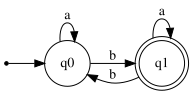
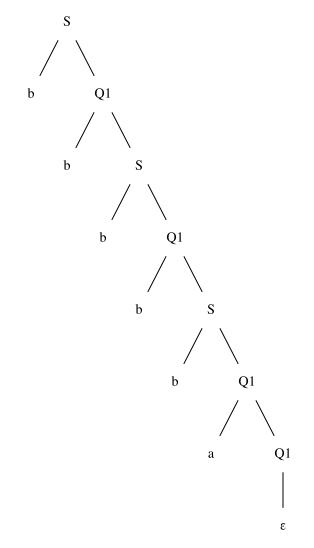

# Exercise 4.2: Strings with an Odd Number of 'b's

## 1. Language Description
This automata recognizes the language `L = {w ∈ {a,b}* | w has an odd number of 'b's}`. The language consists of all strings over the alphabet `{a, b}` that contain an odd number of the symbol 'b'. The number of 'a's is irrelevant.

---
## 2. Sample Strings
* **Accepted Strings:**
    1.  `b`
    2.  `ab`
    3.  `bab`
    4.  `bba`
    5.  `bbb`
    6.  `aaab`
    7.  `ababa`
    8.  `babbb`
    9.  `aaaaab`
    10. `bbbbba`

* **Rejected Strings:**
    1.  `ε` (empty string)
    2.  `a`
    3.  `aa`
    4.  `bb`
    5.  `aba`
    6.  `baba`
    7.  `aabb`
    8.  `baab`
    9.  `bbbb`
    10. `aaabb`

---
## 3. Automata Diagram

---
## 4. Automata Type and Justification
* **Type**: **DFA (Deterministic Finite Automata)**.
* **Justification**: It is a DFA because for every state, there is exactly one defined transition for each symbol in the alphabet (`a` and `b`). The automata's path is uniquely determined, and it does not use ε-transitions.

---
## 5. Formal Definition (5-Tuple)
The 5-tuple `M = (Q, Σ, δ, q₀, F)` that defines this automata is:
* **Q** = `{q0, q1}`
* **Σ** = `{a, b}`
* **q₀** = `q0`
* **F** = `{q1}`
* **δ** (Transition Function):

| State | Input 'a' | Input 'b' | Description |
| :---: | :---: | :---: | :--- |
| **q0** | q0 | q1 | Even 'b's count (Initial) |
| **q1** | q1 | q0 | Odd 'b's count (Accepting) |

---
## 6. Source Files
* **Graphviz Source:** [View `automata.dot`](./automata.dot)
* **JFLAP File:** [Download `automata.jff`](./automata.jff)

---
## 7. Regular Grammar (Type 3)
This automaton can be converted into an equivalent Type 3 Regular Grammar `G = (V, T, P, S)`:
* **V (Variables):** `{S, Q1}`
* **T (Terminals):** `{a, b}`
* **S (Start Symbol):** `S` (which represents `q0`)
* **P (Production Rules):**
    * `S → a S`
    * `S → b Q1`
    * `Q1 → a Q1`
    * `Q1 → b S`
    * `Q1 → ε`      (because `q1` is an accepting state)

---
## 8. Derivation Example
This shows how the grammar generates the accepted string "**bbbbba**".

### Derivation Path
1.  `S → b Q1`
2.  `Q1 → b S`
3.  `S → b Q1`
4.  `Q1 → b S`
5.  `S → b Q1`
6.  `Q1 → a Q1`
7.  `Q1 → ε`

### Parse Tree

* **Graphviz Source (Parse Tree):** [View `parse_tree.dot`](./parse_tree.dot)