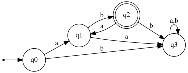
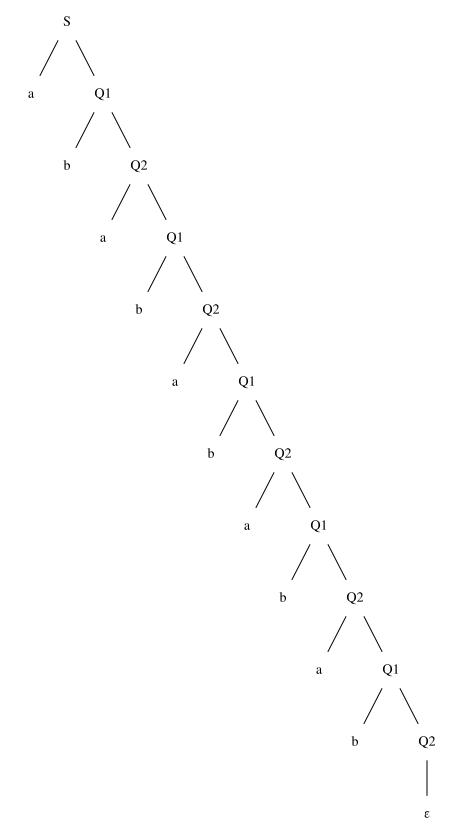

# Exercise 5.1 (Revised): Recognize the language (ab)+

## 1. Language Description
This automata recognizes the language `L = {(ab)+}`, which is defined by the regular expression `(ab)+`. This language consists of all strings formed by one or more concatenations of the substring "ab".

---
## 2. Sample Strings
* **Accepted Strings:**
    1.  `ab`
    2.  `abab`
    3.  `ababab`
    4.  `abababab`
    5.  `ababababab`
    6.  `(ab)⁶`
    7.  `(ab)⁷`
    8.  `(ab)⁸`
    9.  `(ab)⁹`
    10. `(ab)¹⁰`

* **Rejected Strings:**
    1.  `ε` (empty string)
    2.  `a`
    3.  `b`
    4.  `aa`
    5.  `bb`
    6.  `aba`
    7.  `bab`
    8.  `abba`
    9.  `aab`
    10. `bba`

---
## 3. Automata Diagram

---
## 4. Automata Type and Justification
* **Type**: **DFA (Deterministic Finite Automata)**.
* **Justification**: It is a DFA because for every state, there is exactly one defined transition for each symbol in the alphabet (`a` and `b`). The automata's path is uniquely determined for any input string, and it does not use ε-transitions. A trap state (`q3`) is used to handle all invalid sequences.

---
## 5. Formal Definition (5-Tuple)
The 5-tuple `M = (Q, Σ, δ, q₀, F)` that defines this automata is:
* **Q** = `{q0, q1, q2, q3}`
* **Σ** = `{a, b}`
* **q₀** = `q0`
* **F** = `{q2}`
* **δ** (Transition Function):

| State | Input 'a' | Input 'b' | Description |
| :---: | :---: | :---: | :--- |
| **q0** | q1 | q3 | Initial State / Even position |
| **q1** | q3 | q2 | Odd position (after 'a') |
| **q2** | q1 | q3 | Even position (after 'b', Accepting) |
| **q3** | q3 | q3 | Trap State |

---
## 6. Source Files
* **Graphviz Source:** [View `automata.dot`](./automata.dot)
* **JFLAP File:** [Download `automata.jff`](./automata.jff)

---
## 7. Regular Grammar (Type 3)
This automaton can be converted into an equivalent Type 3 Regular Grammar `G = (V, T, P, S)`:
* **V (Variables):** `{S, Q1, Q2, Q3}`
* **T (Terminals):** `{a, b}`
* **S (Start Symbol):** `S` (which represents `q0`)
* **P (Production Rules):**
    * `S → a Q1`
    * `S → b Q3`
    * `Q1 → a Q3`
    * `Q1 → b Q2`
    * `Q2 → a Q1`
    * `Q2 → b Q3`
    * `Q3 → a Q3`
    * `Q3 → b Q3`
    * `Q2 → ε`      (because `q2` is an accepting state)

---
## 8. Derivation Example
This shows how the grammar generates the accepted string "**ababababab**".

### Derivation Path
1.  `S → a Q1`
2.  `Q1 → b Q2`
3.  `Q2 → a Q1`
4.  `Q1 → b Q2`
5.  `Q2 → a Q1`
6.  `Q1 → b Q2`
7.  `Q2 → a Q1`
8.  `Q1 → b Q2`
9.  `Q2 → a Q1`
10. `Q1 → b Q2`
11. `Q2 → ε`

### Parse Tree

* **Graphviz Source (Parse Tree):** [View `parse_tree.dot`](./parse_tree.dot)