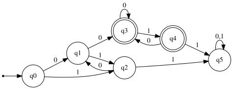

# Exercise 5.2: Contains "00" but not "11"

## 1. Language Description
This automata recognizes the language `L = {w ∈ {0,1}* | w contains the substring "00" AND w does not contain the substring "11"}`. A string is accepted only if "00" appears somewhere in it and "11" never appears.

---
## 2. Sample Strings
* **Accepted Strings:**
    1.  `00`
    2.  `100`
    3.  `001`
    4.  `000`
    5.  `10100`
    6.  `0100`
    7.  `10010`
    8.  `0010`
    9.  `001010`
    10. `10001`

* **Rejected Strings:**
    1.  `ε` (does not contain "00")
    2.  `0` (does not contain "00")
    3.  `1` (does not contain "00")
    4.  `10` (does not contain "00")
    5.  `01` (does not contain "00")
    6.  `11` (contains "11")
    7.  `0011` (contains "11")
    8.  `1100` (contains "11")
    9.  `01010` (does not contain "00")
    10. `10101` (does not contain "00")

---
## 3. Automata Diagram

---
## 4. Automata Type and Justification
* **Type**: **DFA (Deterministic Finite Automata)**.
* **Justification**: It is a DFA because for every state, there is exactly one defined transition for each symbol in the alphabet (`0` and `1`). The automata's path is uniquely determined. A trap state (`q5`) is used to reject any string as soon as the forbidden "11" substring is detected.

---
## 5. Formal Definition (5-Tuple)
The 5-tuple `M = (Q, Σ, δ, q₀, F)` that defines this automata is:
* **Q** = `{q0, q1, q2, q3, q4, q5}`
* **Σ** = `{0, 1}`
* **q₀** = `q0`
* **F** = `{q3, q4}`
* **δ** (Transition Function):

| State | Input '0' | Input '1' | Description |
| :---: | :---: | :---: | :--- |
| **q0** | q1 | q2 | Initial State |
| **q1** | q3 | q2 | Last seen '0' (no '00' yet) |
| **q2** | q1 | q5 | Last seen '1' (no '11' yet) |
| **q3** | q3 | q4 | Contains '00', last seen '0' (Accepting) |
| **q4** | q3 | q5 | Contains '00', last seen '1' (Accepting) |
| **q5** | q5 | q5 | Contains '11' (Trap State) |

---
## 6. Source Files
* **Graphviz Source:** [View `automata.dot`](./automata.dot)
* **JFLAP File:** [Download `automata.jff`](./automata.jff)