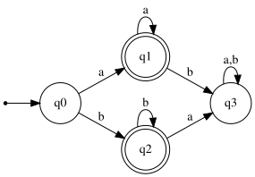
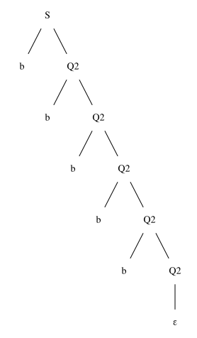

# Exercise 6.1: Recognize the language aa* | bb*

## 1. Language Description
This automata recognizes the language defined by the regular expression `aa* | bb*`. This is equivalent to `a+ | b+`, which represents the set of all non-empty strings consisting entirely of 'a's, or entirely of 'b's. Strings cannot contain a mix of 'a's and 'b's.

---
## 2. Sample Strings
* **Accepted Strings:**
    1.  `a`
    2.  `aa`
    3.  `aaa`
    4.  `aaaa`
    5.  `aaaaa`
    6.  `b`
    7.  `bb`
    8.  `bbb`
    9.  `bbbb`
    10. `bbbbb`

* **Rejected Strings:**
    1.  `ε` (empty string)
    2.  `ab`
    3.  `ba`
    4.  `aba`
    5.  `bab`
    6.  `aab`
    7.  `bba`
    8.  `abab`
    9.  `baba`
    10. `aabb`

---
## 3. Automata Diagram

---
## 4. Automata Type and Justification
* **Type**: **DFA (Deterministic Finite Automata)**.
* **Justification**: It is a DFA because for every state, there is exactly one defined transition for each symbol in the alphabet (`a` and `b`). All invalid sequences (e.g., mixing 'a's and 'b's) are explicitly handled by transitioning to a non-accepting trap state (`q3`).

---
## 5. Formal Definition (5-Tuple)
The 5-tuple `M = (Q, Σ, δ, q₀, F)` that defines this automata is:
* **Q** = `{q0, q1, q2, q3}`
* **Σ** = `{a, b}`
* **q₀** = `q0`
* **F** = `{q1, q2}`
* **δ** (Transition Function):

| State | Input 'a' | Input 'b' | Description |
| :---: | :---: | :---: | :--- |
| **q0** | q1 | q2 | Initial State |
| **q1** | q1 | q3 | 'a' sequence (Accepting) |
| **q2** | q3 | q2 | 'b' sequence (Accepting) |
| **q3** | q3 | q3 | Trap State |

---
## 6. Source Files
* **Graphviz Source:** [View `automata.dot`](./automata.dot)
* **JFLAP File:** [Download `automata.jff`](./automata.jff)

---
## 7. Regular Grammar (Type 3)
This automaton can be converted into an equivalent Type 3 Regular Grammar `G = (V, T, P, S)`:
* **V (Variables):** `{S, Q1, Q2, Q3}`
* **T (Terminals):** `{a, b}`
* **S (Start Symbol):** `S` (which represents `q0`)
* **P (Production Rules):**
    * `S → a Q1`
    * `S → b Q2`
    * `Q1 → a Q1`
    * `Q1 → b Q3`
    * `Q2 → a Q3`
    * `Q2 → b Q2`
    * `Q3 → a Q3`
    * `Q3 → b Q3`
    * `Q1 → ε`      (because `q1` is an accepting state)
    * `Q2 → ε`      (because `q2` is an accepting state)

---
## 8. Derivation Example
This shows how the grammar generates the accepted string "**bbbbb**".

### Derivation Path
1.  `S → b Q2`
2.  `Q2 → b Q2`
3.  `Q2 → b Q2`
4.  `Q2 → b Q2`
5.  `Q2 → b Q2`
6.  `Q2 → ε`

### Parse Tree

* **Graphviz Source (Parse Tree):** [View `parse_tree.dot`](./parse_tree.dot)