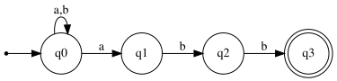

# Exercise 6.1: NFA for Strings Ending with "abb"

## 1. Language Description
This automata recognizes the language defined by the regular expression `(a|b)*abb`. This includes all strings over the alphabet `Σ = {a, b}` that end with the substring "abb". The exercise explicitly requests the construction of a Non-deterministic Finite Automata (NFA).

---
## 2. Sample Strings
* **Accepted Strings:**
    1.  `abb`
    2.  `aabb`
    3.  `babb`
    4.  `aaabb`
    5.  `ababb`
    6.  `baabb`
    7.  `bbabb`
    8.  `abababb`
    9.  `aaaaabb`
    10. `bbbbabb`

* **Rejected Strings:**
    1.  `ε` (empty string)
    2.  `a`
    3.  `b`
    4.  `ab`
    5.  `abba`
    6.  `abab`
    7.  `bba`
    8.  `aab`
    9.  `aa`
    10. `bb`

---
## 3. Automata Diagram

---
## 4. Automata Type and Justification
* **Type**: **NFA (Non-deterministic Finite Automata)**.
* **Justification**: It is an NFA because the behavior is not always uniquely determined. Specifically, state `q0` has two possible transitions for the input symbol 'a' (it can loop back to `q0` or jump to `q1`). Furthermore, states `q1`, `q2`, and `q3` have incomplete transition functions (e.g., there is no defined path from `q1` on input 'a').

---
## 5. Formal Definition (5-Tuple)
The 5-tuple `M = (Q, Σ, δ, q₀, F)` that defines this automata is:
* **Q** = `{q0, q1, q2, q3}`
* **Σ** = `{a, b}`
* **q₀** = `q0`
* **F** = `{q3}`
* **δ** (Transition Function):

| State | Input 'a' | Input 'b' | Description |
| :---: | :---: | :---: | :--- |
| **q0** | {q0, q1} | {q0} | Initial State |
| **q1** | ∅ | {q2} | Guessed that 'a' is the start of the suffix |
| **q2** | ∅ | {q3} | Has seen suffix "...ab" |
| **q3** | ∅ | ∅ | Suffix "abb" is complete (Accepting) |

---
## 6. Source Files
* **Graphviz Source:** [View `automata.dot`](./automata.dot)
* **JFLAP File:** [Download `automata.jff`](./automata.jff)