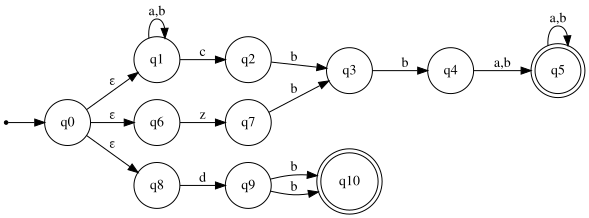

# Exercise 6.2: NFA for a Complex Union

## 1. Language Description
This automata recognizes the language `L = (a|b)*cbb(a|b)+ | zbb(a|b)+ | dbb`. The language is a union of three distinct patterns:
1.  Any string of 'a's and 'b's, followed by "cbb", followed by one or more 'a's or 'b's.
2.  The string "zbb", followed by one or more 'a's or 'b's.
3.  The literal string "dbb".

An NFA is the most direct way to model this language due to the top-level union.

---
## 2. Sample Strings
* **Accepted Strings:**
    1.  `dbb`
    2.  `cbba`
    3.  `cbbb`
    4.  `zbba`
    5.  `zbbb`
    6.  `acbba`
    7.  `bbbcbbb`
    8.  `zbbab`
    9.  `cbbab`
    10. `aabcbbabab`

* **Rejected Strings:**
    1.  `ε` (empty string)
    2.  `a`
    3.  `cbb` (must be followed by at least one 'a' or 'b')
    4.  `zbb` (must be followed by at least one 'a' or 'b')
    5.  `db`
    6.  `c`
    7.  `z`
    8.  `d`
    9.  `acbb`
    10. `azbb`

---
## 3. Automata Diagram

---
## 4. Automata Type and Justification
* **Type**: **NFA (Non-deterministic Finite Automata)**.
* **Justification**: It is an NFA because it heavily relies on `ε`-transitions from the start state to non-deterministically choose which of the three patterns in the union to attempt to match. This branching into multiple possible paths without consuming input is a key characteristic of non-determinism.

---
## 5. Formal Definition (5-Tuple)
The 5-tuple `M = (Q, Σ, δ, q₀, F)` that defines this automata is:
* **Q** = `{q0, q1, q2, q3, q4, q5, q6, q7, q8, q9, q10}`
* **Σ** = `{a, b, c, d, z}`
* **q₀** = `q0`
* **F** = `{q5, q10}`
* **δ** (Transition Function):
    * `δ(q0, ε) = {q1, q6, q8}`
    * **Path 1**: `δ(q1, a) = {q1}`, `δ(q1, b) = {q1}`, `δ(q1, c) = {q2}`, `δ(q2, b) = {q3}`, `δ(q3, b) = {q4}`, `δ(q4, a) = {q5}`, `δ(q4, b) = {q5}`, `δ(q5, a) = {q5}`, `δ(q5, b) = {q5}`
    * **Path 2**: `δ(q6, z) = {q7}`, `δ(q7, b) = {q3}`
    * **Path 3**: `δ(q8, d) = {q9}`, `δ(q9, b) = {q10}`

---
## 6. Source Files
* **Graphviz Source:** [View `automata.dot`](./automata.dot)
* **JFLAP File:** [Download `automata.jff`](./automata.jff)