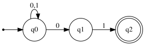

# Exercise 6.2: NFA for Strings Ending with "01"

## 1. Language Description
This automata recognizes the language of all binary strings that end with the substring "01". The corresponding regular expression is `(0|1)*01`. The exercise explicitly requests the construction of a Non-deterministic Finite Automata (NFA).

---
## 2. Sample Strings
* **Accepted Strings:**
    1.  `01`
    2.  `001`
    3.  `101`
    4.  `1101`
    5.  `0101`
    6.  `0001`
    7.  `1001`
    8.  `01101`
    9.  `11101`
    10. `00101`

* **Rejected Strings:**
    1.  `ε` (empty string)
    2.  `0`
    3.  `1`
    4.  `10`
    5.  `00`
    6.  `11`
    7.  `100`
    8.  `010`
    9.  `1011`
    10. `0110`

---
## 3. Automata Diagram

---
## 4. Automata Type and Justification
* **Type**: **NFA (Non-deterministic Finite Automata)**.
* **Justification**: This is an NFA for two main reasons:
    1.  **Multiple Transitions**: State `q0` has two possible transitions for the input symbol '0' (it can loop to `q0` or jump to `q1`).
    2.  **Incomplete Transitions**: States `q1` and `q2` do not have defined transitions for all symbols in the alphabet. For example, there is no path from `q1` if the next symbol is '0'.

---
## 5. Formal Definition (5-Tuple)
The 5-tuple `M = (Q, Σ, δ, q₀, F)` that defines this automata is:
* **Q** = `{q0, q1, q2}`
* **Σ** = `{0, 1}`
* **q₀** = `q0`
* **F** = `{q2}`
* **δ** (Transition Function):

| State | Input '0' | Input '1' | Description |
| :---: | :---: | :---: | :--- |
| **q0** | {q0, q1} | {q0} | Initial State |
| **q1** | ∅ | {q2} | Guessed that '0' is the start of the suffix |
| **q2** | ∅ | ∅ | Suffix "01" is complete (Accepting) |

---
## 6. Source Files
* **Graphviz Source:** [View `automata.dot`](./automata.dot)
* **JFLAP File:** [Download `automata.jff`](./automata.jff)