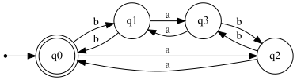

# Extra Credit: Even 'a's and Even 'b's

## 1. Language Description
This automata recognizes the language `L = {Z ∈ {a,b}* | Z contains an even number of 'a's AND an even number of 'b's}`. The count for both symbols must be even. Zero is considered an even number, so the empty string (`ε`) is accepted.

---
## 2. Sample Strings
* **Accepted Strings:**
    1.  `ε` (empty string)
    2.  `aa`
    3.  `bb`
    4.  `aabb`
    5.  `bbaa`
    6.  `abab`
    7.  `baba`
    8.  `aaaa`
    9.  `bbbb`
    10. `ababbaba`

* **Rejected Strings:**
    1.  `a`
    2.  `b`
    3.  `ab`
    4.  `ba`
    5.  `aab`
    6.  `bba`
    7.  `aaa`
    8.  `bbb`
    9.  `abb`
    10. `baa`

---
## 3. Automata Diagram

---
## 4. Automata Type and Justification
* **Type**: **DFA (Deterministic Finite Automata)**.
* **Justification**: It is a DFA because for every state, there is exactly one defined transition for each symbol in the alphabet (`a` and `b`). The automata's path is uniquely determined for any input string, and it does not use ε-transitions.

---
## 5. Formal Definition (5-Tuple)
The 5-tuple `M = (Q, Σ, δ, q₀, F)` that defines this automata is:
* **Q** = `{q0, q1, q2, q3}`
* **Σ** = `{a, b}`
* **q₀** = `q0`
* **F** = `{q0}`
* **δ** (Transition Function):

| State | Input 'a' | Input 'b' | Description (Parity 'a's, Parity 'b's) |
| :---: | :---: | :---: | :--- |
| **q0** | q2 | q1 | (Even, Even) - Initial & Accepting |
| **q1** | q3 | q0 | (Even, Odd) |
| **q2** | q0 | q3 | (Odd, Even) |
| **q3** | q1 | q2 | (Odd, Odd) |

---
## 6. Source Files
* **Graphviz Source:** [View `automata.dot`](./automata.dot)
* **JFLAP File:** [Download `automata.jff`](./automata.jff)